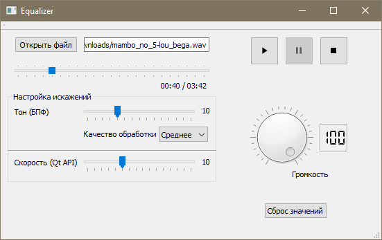

# equalizer
Program, which can modify sounds: change it's speed and change it's tone without changing speed

## Build

You can build project with Qt Creator. Or, you can generate project files for MS Visual Studio via CMake.
First of all, download `msvc2015` bundle from Qt server. Then, for example, create new directory for build and move there. Then, execute command:

```powershell
cmake.exe -G"Visual Studio 14 2015 Win64" -DCMAKE_PREFIX_PATH="C:/Qt/5.11.2/msvc2015_64/lib/cmake"  ..\
```
`DCMAKE_PREFIX_PATH`- full path to cmake stuff (vs2015 Qt bundle).

## How-To: usage


Full description will be soon.

## Inside the program

Program can open files in WAVE format. Maximum bits per sample: 16. Allowed mono and stereo.
File reader made 'from scratch' (`Wave.h` and `Wave.cpp`). Pitch shifting made by [Stephan M. Bernsee](http://blogs.zynaptiq.com/bernsee/repo/smbPitchShift.cpp) (`pitcher.h` and `pitcher.cpp`), which implements [Discrete Fourier Transform](https://en.wikipedia.org/wiki/Discrete_Fourier_transform)
